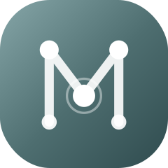
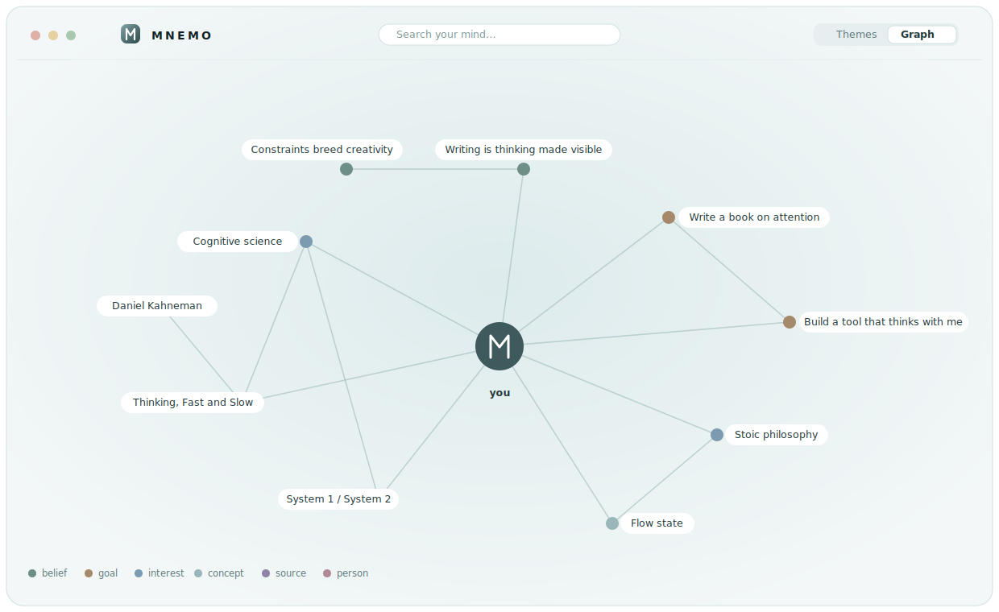
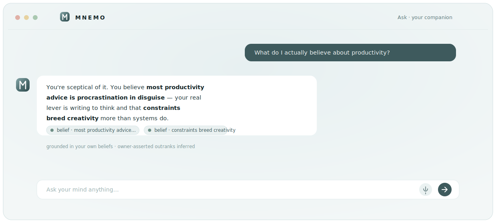

<div align="center">



# MNEMO

### Your second brain — that lives entirely on your machine.

**A private, local-first personal knowledge graph and AI companion.** Feed it what you read, write, think, and capture. It weaves everything into a living graph, learns *how you think*, and reasons in your voice — with **nothing ever leaving your device**.

<br/>

[](LICENSE)


<sub>Postgres + pgvector · Drizzle · local MiniLM embeddings · Ollama (or any OpenAI-compatible LLM) · Tailwind v4 · MCP</sub>

<br/>



<sub><i>Your knowledge, connected — the graph view (shown with a demo brain).</i></sub>

</div>

---

> [!NOTE]
> **This repo is the *shell*, not a brain.** You clone it and it becomes *yours* — your notes, your graph, your voice — all stored and reasoned over on your own hardware. There is no hosted version, no account, no telemetry. The maintainer's brain stays on the maintainer's Mac.

## Why MNEMO?

Note apps store text. MNEMO builds a **mind**.

- 🧠 **A real knowledge graph, not a pile of notes.** Everything you feed it is distilled into typed *atoms* — beliefs, goals, traits, people, places, ideas — connected by typed, weighted, reasoned edges (`supports`, `contradicts`, `influenced_by`…). It reasons *across* your knowledge, not just searches it.
- 🔒 **Private by architecture.** Embeddings run locally. The LLM runs locally (Ollama). Private notes are encrypted at rest. When the model is on your machine, MNEMO can safely learn from your most personal material — because it physically cannot leave.
- 🪞 **It learns *how you think*.** A self-model ("who you are" + "how you reason") is rebuilt nightly from your own words, so the agent answers in your voice and weighs trade-offs the way you do.
- 🌙 **It optimizes itself while you sleep.** Nightly it de-duplicates, re-weights what matters, surfaces contradictions, and sharpens its model of you. The graph gets *cleaner* as it grows, not noisier.
- 🆓 **Free to run forever.** Local embeddings + a local model = no per-token bill, no rate limits, no quota. Bring a cloud key only if you *want* a bigger model.
- 🤲 **Senses & hands.** Connect Gmail, Calendar, Notion, GitHub. It reads freely; anything it wants to *do* is proposed for your one-tap approval — never done silently.

<div align="center"><br/>

<br/><sub><i>Ask anything — it answers in your voice, grounded in your own beliefs (owner-asserted outranks inferred). The mark is an “M” drawn as a memory-graph: nodes, edges, and a hub — the self everything connects to.</i></sub>
<br/><br/></div>

## ✨ Features

| | |
|---|---|
| 🧩 **Knowledge graph** | 20 node types, 16 edge types, hybrid search (keyword + semantic, re-ranked by salience & recency) |
| 💬 **Agent companion** | A tool-using agent that reasons step-by-step, grounds every claim in your graph, and verifies its own draft before answering |
| ⏰ **Automations** | Owner-defined recurring tasks ("every morning, research X and tie it to my notes") that run on schedule and land in your inbox |
| 🔬 **Deep research** | An async, multi-round investigation: grounds in what you know → plans sub-questions → gathers the web → a cited brief tied back to your graph |
| 📸 **Vision** | Drop in photos — it understands them, links the people/places, and recognises recurring faces across your library |
| 🎙️ **Private voice** | On-device speech-to-text (whisper.cpp) **and** text-to-speech read-aloud — voice in and out, nothing hits a cloud service |
| 📥 **Ingest anything** | Notes, articles, PDFs, Readwise, Pocket, Notion, X archive, browser history, WhatsApp/Takeout exports — distilled, signal kept, noise dropped |
| 🌐 **Connectors** | Gmail · Calendar · Notion · GitHub — read freely, act only with approval |
| 🔄 **Self-optimizing** | Nightly consolidation, contradiction detection, salience reconciliation, persona rebuild |
| 📱 **Everywhere** | Installable PWA, offline graph + search, Siri Shortcuts, MCP server for any MCP client |
| 💾 **Yours to keep** | One-command encrypted backups + restore. Your brain is never locked in |

## 🏗️ How it works

```
   capture / connectors / photos / voice
                  │
                  ▼
   ┌──────────────────────────────┐
   │  INGEST  acquire → chunk →    │   local MiniLM embeddings (384-d)
   │  embed → extract → link       │   typed atoms + reasoned edges
   └──────────────┬───────────────┘
                  ▼
        ╔════════════════════╗
        ║   KNOWLEDGE GRAPH  ║   Postgres + pgvector + pg_trgm
        ║  nodes ◄──edges──► ║   hybrid search, versioned beliefs
        ╚═════════╦══════════╝
        ┌─────────┴──────────┐
        ▼                    ▼
   NIGHTLY SYNTHESIS     AGENT  (reason → tools → reflect → answer)
   dedupe · contradictions   grounded in YOU, in your voice
   salience · persona        reads free · acts on approval
        │                    │
        └─────────┬──────────┘
                  ▼
        Ask · Graph · Digest · Siri · MCP
```

The data model and design rationale live in [`docs/PLAN.md`](docs/PLAN.md).

## 🚀 Quickstart

**Prerequisites:** Node ≥ 20 · pnpm (`corepack enable`) · Postgres 16 (+ `pgvector`) · [Ollama](https://ollama.com) for the local model.

```bash
git clone https://github.com/0-uddeshya-0/mnemo.git
cd mnemo
pnpm install

# 1) configure
cp .env.example .env
#    set MNEMOSYNE_PASSWORD and a 32+ char SESSION_SECRET
#    point DATABASE_URL at your Postgres

# 2) local model (private + free, no keys)
ollama pull qwen2.5:7b           # text / reasoning
ollama pull qwen2.5vl:7b         # vision (optional)
#    in .env:  OPENROUTER_BASE_URL=http://localhost:11434/v1
#              LLM_MODEL=qwen2.5:7b

# 3) database
pnpm db:migrate                  # extensions, tables, HNSW + full-text indexes
pnpm db:seed                     # a small demo brain so the UI isn't empty

# 4) run
pnpm --filter @mnemosyne/web dev      # → http://localhost:3000
pnpm --filter @mnemosyne/web worker   # ingest + nightly synthesis + digest
```

Open **http://localhost:3000**, set your password, and start feeding your mind.
Full setup (production launchd services, Tailscale access, Siri, connectors) is in [`SETUP.md`](SETUP.md).

> **Prefer a cloud model?** Leave `OPENROUTER_BASE_URL` at OpenRouter and set `OPENROUTER_API_KEY` — any OpenAI-compatible endpoint works. Private content stays walled off automatically whenever a cloud model is active.

## 🔐 Privacy model

| Layer | Guarantee |
|---|---|
| Embeddings | Computed locally (transformers.js). Never sent anywhere. |
| LLM | Runs on your machine via Ollama by default. |
| Private notes | Encrypted at rest (AES-256-GCM, key derived from your password). |
| Cloud opt-in | If you switch to a cloud model, `private` content is automatically excluded. |
| Backups | Stored locally, `0700`, encrypted bodies preserved. |
| Telemetry | None. There is no server to phone home to. |

## 🗺️ Roadmap

- [ ] Face-embedding recognition (beyond appearance clustering)
- [ ] Richer in-app graph editing & merge review
- [ ] Native iOS app via App Intents
- [ ] Pluggable model profiles (fast interactive vs. deep nightly)
- [ ] More connectors

## 🛠️ Tech stack

**Next.js 15** (App Router, RSC, server actions) · **React 19** · **TypeScript (strict)** · **Postgres 16** + **pgvector** + **pg_trgm** · **Drizzle ORM** · **pg-boss** queues · **transformers.js** (local MiniLM) · **Ollama** / any OpenAI-compatible LLM · **whisper.cpp** · **Tailwind v4** + **shadcn/ui** · **Model Context Protocol** SDK.

## 🤝 Contributing

Issues and PRs are welcome. This is a personal-AI shell meant to be forked and made your own — fork it, make it yours, and send back anything that would help the next person.

## 📜 License

[MIT](LICENSE) — do what you like, keep the copyright notice. Your data is yours; this code is everyone's.

<div align="center"><br/><sub>Built to remember, so you're free to think.</sub></div>
